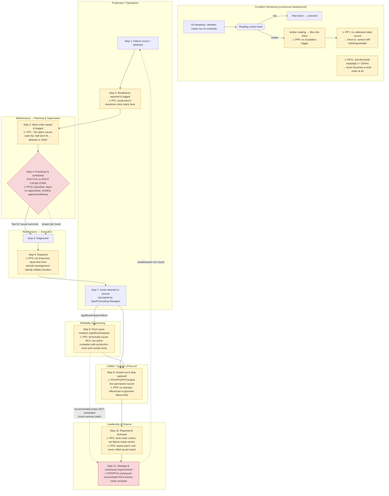
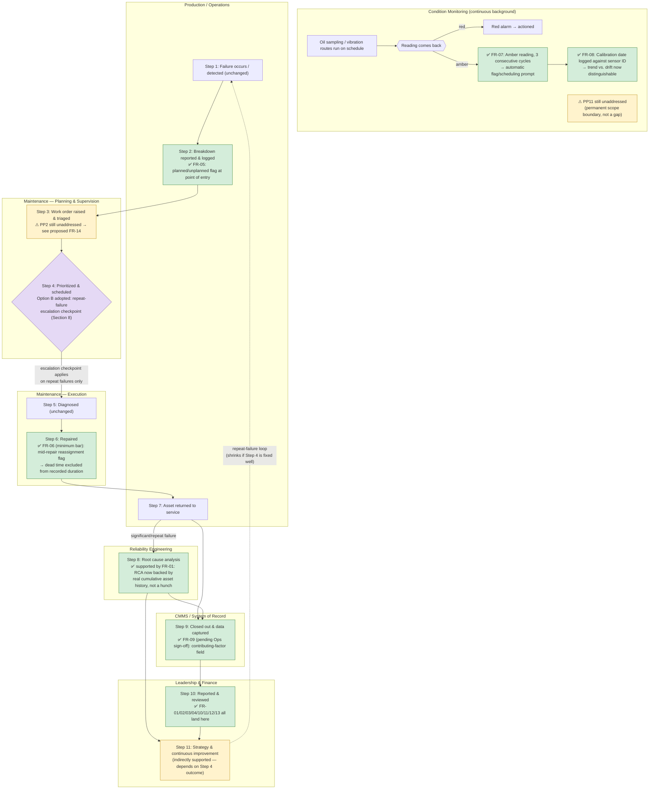

# 04 — Process Maps: Breakdown-to-Repair Lifecycle

**Project:** Reducing Unplanned Equipment Downtime & Improving Maintenance Reliability
**Prepared by:** Gagana Suresh, Business Analyst
**Status:** As-Is map (Sections 1–5) and To-Be map (Sections 6–9) complete. Step 4 redesign decision resolved 7 September 2026 — Option B (repeat-failure escalation checkpoint) adopted, Option C deferred as a future-phase recommendation pending Finance/capital-planning validation. See Section 8.
**Date:** 4 September 2026
**Source documents:** `03-BRD-Maintenance-Reporting.md` (Section 6, current-state pain points; Section 8, functional requirements) · `02-Stakeholder-Register.md` (Section 2, Technique A lifecycle walk-through — this map extends that 11-step skeleton with the specific breakdowns discovery found at each step) · six interview transcripts

**A note on format:** the Master Plan calls for diagrams built in draw.io/Lucidchart from a structured swimlane description. This document delivers that structured description (Section 2, chain-of-thought decomposition of the process into discrete steps and swimlane owners) **and** a rendered version as a Mermaid flowchart (Section 3) — Mermaid is plain text, version-controls cleanly alongside the rest of this Markdown-based repo, and renders natively on GitHub with no separate diagram file needed. This is a disclosed adaptation of the original plan, not a silent shortcut: if a true BPMN swimlane diagram is wanted specifically for the video walkthrough, the structured description in Section 2 is what a draw.io/Lucidchart version would be built from — nothing here blocks producing one later.

---

## 1. How to read this map

Eleven process steps, inherited from the stakeholder register's lifecycle walk-through (`02-Stakeholder-Register.md` Section 2), extended here with exactly where each of the BRD's eleven documented pain points (`03-BRD-Maintenance-Reporting.md` Section 6, referenced below as **PP1–PP11**) actually bites within that sequence. A pain point is not a vague "the CMMS is messy" — each one is tied to a specific step, a specific interview source, and (via the pain-point index in Section 5) a specific functional requirement already committed to in the BRD. That traceability — pain point → process step → BRD requirement — is the whole point of building this map after the BRD rather than before it: it proves the requirements were derived from a real, walked-through process, not written in the abstract.

Two decision points recur in the As-Is map and are marked explicitly rather than smoothed over: the **fast-fix vs. root-cause fork** (Steps 6–8, where "get it running" almost always beats "fix it properly" — Risk 1 and Risk 2 in the BRD), and the **repeat-failure loop** (a quick fix returns the asset to service, only for the same failure mode to resurface weeks later — the alternator-mount and mill-gearbox-contamination examples in the BRD's Section 6).

---

## 2. Swimlane walkthrough (structured decomposition)

**Lane: Production/Operations** (Equipment Operator, Dispatch Coordinator)
**Lane: Maintenance — Planning & Supervision** (Maintenance Planner, Maintenance Superintendent – Mobile/Fixed Plant, Maintenance Supervisor)
**Lane: Maintenance — Execution & Condition Monitoring** (Maintenance Technician/Fitter, Condition Monitoring Technician)
**Lane: Reliability Engineering**
**Lane: CMMS / System of Record**
**Lane: Leadership & Finance** (Maintenance Manager, Mining/Operations Manager, Financial Controller, General Manager)

**Step 0 — Continuous background activity (not a discrete event): condition monitoring.** Oil sampling and vibration routes run on schedule; readings come back green/amber/red. **This is where PP6 and PP7 actually originate**, even though their effect isn't felt until much later: red alarms get actioned, but amber readings have no escalation trigger and pile up in an inbox until someone manually reviews historical reports (PP6 — Reliability Engineer, Q7). Even when a trend is caught, there's no record of how recently the sensor itself was calibrated, so a genuine early-warning trend and a fouled or drifting sensor are indistinguishable (PP7 — Instrumentation & Controls Engineer, Q4–Q5). **This step is also where PP11 lives structurally, not as an event but as an absence:** stoppages under roughly 15 minutes — a conveyor tripping and resetting, an excavator stalling and restarting — never generate a work order and never enter this process at all (PP11 — Reliability Engineer, Q11, unprompted).

**Step 1 — Failure occurs / detected.** An asset breaks down, or an operator notices abnormal performance (a noise, a warning light, a fault code). Owned by: Equipment Operator, Dispatch Coordinator.

**Step 2 — Breakdown reported & logged.** The operator radios it in or a shift supervisor calls it through; Dispatch logs a stoppage in production's own shift-log system. **PP1 begins here:** production starts its own downtime clock at this point, independently of whatever the CMMS will later record — the first of the two unsynchronized clocks that routinely disagree by the time anyone compares them (Maintenance Superintendent – Fixed Plant, Q2).

**Step 3 — Work order raised & triaged.** The Maintenance Planner (or, on fixed plant, the Superintendent directly) raises a work order in the CMMS and assesses urgency. **PP2 bites here:** the cause-code field offers roughly 40 options, about half of which don't fit what actually happened, so entries default to "other" with the real story — if it's captured at all — left in a free-text comment nobody is required to fill in (Maintenance Superintendent – Fixed Plant, Q2).

**Step 4 — Prioritized & scheduled.** Work is slotted against other jobs and against Production's willingness to release the asset. **This is the first half of the fast-fix-vs-root-cause fork.** If the asset has failed this way before and Reliability has flagged it for a proper repair (Step 8's feedback, dotted line in Section 3), that recommendation is weighed here against Production's immediate need — and normally loses, informally, under time pressure rather than through any documented decision (Reliability Engineer, Q3–Q4; Maintenance Manager, Q9). **PP10 sits underneath this fork structurally, not just as an attitude problem:** a quick patch is opex and can be approved within the Financial Controller's own delegated authority in days; a proper root-cause fix is often capex and queues behind the site's capital round for months — so even when the technical case is strong, the fast fix is frequently the only option actually *available* to approve this week (Financial Controller, Q8 — single-sourced, see BRD Section 13.10).

**Step 5 — Diagnosed.** A tradesperson (or, for complex/recurring cases, the Reliability Engineer) identifies the root symptom before repair starts.

**Step 6 — Repaired.** The physical repair is executed. **PP3, the single most specific mechanism-level finding from discovery, lives here:** nobody times the job live — a tradesperson mid-repair isn't logging a start time, so the eventual duration is reconstructed from memory, sometimes days later. If the crew is pulled off mid-job onto a higher-priority failure, the work order sits open, and when it's finally closed the recorded duration silently includes all the dead time the crew wasn't even on site — the system has no way to separate real repair time from waiting time (Maintenance Superintendent – Fixed Plant, Q4).

**Step 7 — Returned to service.** The asset is handed back and accepted by the Supervisor and the relevant Operations/Processing Manager. **This is where the fast-fix branch of Step 4's fork lands:** if a patch rather than a proper repair was applied, the asset goes back into service with the underlying failure mode still present — feeding directly into the repeat-failure loop back to Step 1 (dotted feedback arrow, Section 3). The Maintenance Manager's alternator-mount example and the Reliability Engineer's mill-gearbox-contamination example are two independent, concrete instances of exactly this loop (BRD Section 6, pain point #5's evidence).

**Step 8 — Root cause analysis (significant/repeat failures).** For failures serious or repetitive enough to warrant it, the Reliability Engineer completes a formal RCA. **PP5 lives here, and it's a completion problem, not a competence problem:** the RCAs are technically sound, but the recommended corrective action competes against Production's immediate need for the asset and usually loses — until the failure repeats, at which point the same RCA gets pulled back out with an "I told you" attached to it, and still doesn't guarantee the action gets scheduled (Reliability Engineer, Q3–Q4, Q9).

**Step 9 — Closed out & data captured.** The work order is formally closed and the failure mode, cause, and (nominally) cost are recorded in the CMMS. **This is where PP1, PP2, and PP3 all finalize into permanent, hard-to-correct records:** the two mismatched downtime clocks are never reconciled at this point, just both get filed; the cause code — "other" or otherwise imprecise — becomes the permanent record of what happened; and the reconstructed, dead-time-inflated duration becomes the official repair time. **PP8 also bites here:** there is no field to flag that a failure may have been operator-influenced (e.g., overload, hard-driving) rather than a genuine wear/design issue, so all of it defaults into maintenance's reliability numbers regardless of true cause (Maintenance Manager, Q11, unprompted).

**Step 10 — Reported & reviewed.** Downtime, cost, and KPI trends are rolled up for the Maintenance Manager, Asset Manager, General Manager, and Financial Controller. **PP4 and PP9 converge here.** PP4: because the CMMS is organized around work orders and assets rather than failure modes, and cause-code entry is inconsistent (PP2), nobody can cleanly query "which failure mode is costing us the most repeat hours across the fleet" without manually reinterpreting free text (Reliability Engineer, Q2). PP9: five or six separate patch-repair work orders on the same asset, each individually small enough to clear approval without scrutiny, are never rolled up against that asset by anyone — so the true cumulative cost of chronic under-investment is invisible even to Finance, who owns the closest thing to a trustworthy number in this whole process (Financial Controller, Q8). This is also the step where the Financial Controller's crusher work-order incident played out — a ~14-hour unplanned-downtime figure that was actually closer to 9 hours once a bundled planned inspection was untangled, caught only because the dollar impact was large enough to be visually obvious (Financial Controller, Q2).

**Step 11 — Strategy & continuous improvement.** Findings are meant to feed maintenance strategy, spares policy, and monitoring investment. In practice, this step is where PP5 and PP10's effects compound over time: RCA recommendations that didn't get scheduled the first time rarely get revisited systematically, and the Reliability Engineer has begun pre-emptively softening his own recommendations before they even reach the Maintenance Manager, because the full-strength version "just gets a sympathetic nod and nothing scheduled" (Reliability Engineer, Q9 — logged as Risk 2 in the BRD). The process, as currently constituted, has no forcing mechanism that reliably closes this loop.

---

## 3. As-Is process flow (rendered diagram)

**Reading the diagram:** amber-filled boxes mark a step where a specific, sourced pain point occurs. Red-filled boxes mark the two structural decision/loop points that don't behave as a clean linear process — the fast-fix/root-cause fork (Step 4) and the repeat-failure loop closing back to Step 1 from Step 11. The dotted arrows are the paths that, per discovery, are technically possible but rare in practice (a proper job getting prioritized at Step 4; an RCA action actually reaching and closing out at Step 11) — drawn dotted deliberately, so the diagram itself shows that the "correct" path is the road less traveled, not the default.

---

## 4. Relationship between the As-Is map above and the To-Be map below

Sections 1–3 above are the As-Is map: what actually happens today, and exactly where each of the eleven pain points bites. Sections 6–9 below are the To-Be map, built as a second pass over this same eleven-step sequence rather than a new document — this keeps "here's what's broken" and "here's what changes" visually comparable step-by-step, and matters for the video walkthrough (as-is shown first, to-be as the reveal, same steps side by side rather than two unrelated diagrams). One redesign decision — how to actually fix the fast-fix/root-cause fork at Step 4 — was deliberately presented as an options analysis rather than a single assumed answer, per the Master Plan's own instruction for this deliverable (Week 2, Day 7): "propose 2–3 to-be redesign options with trade-offs... forces you to make and justify the actual decision." That decision was Gagana's to make, not Claude's to pick on her behalf — **resolved 7 September 2026: Option B adopted, Option C deferred (Section 8).**

---

## 5. Pain-point index (traceability: process step → BRD requirement)

| Pain point | Process step | Interview source | Addressed by |
|---|---|---|---|
| PP1 — Two unsynchronized downtime clocks | Steps 2, 9, 10 | Maintenance Superintendent – Fixed Plant, Q2; Financial Controller, Q2 | FR-05 |
| PP2 — ~40-option cause-code dropdown, half don't fit | Steps 3, 9 | Maintenance Superintendent – Fixed Plant, Q2 | FR-05 (partial — see BRD Section 17, Action 2, CMMS-feasibility validation) |
| PP3 — Repair duration not timed live; dead time absorbed | Steps 6, 9 | Maintenance Superintendent – Fixed Plant, Q4 | FR-06 |
| PP4 — CMMS is work-order-centric, not failure-mode-centric | Step 10 | Reliability Engineer, Q2 | FR-02, FR-11 |
| PP5 — RCA technically sound but rarely converts to action | Steps 8, 11 | Reliability Engineer, Q3–Q4, Q9; Maintenance Manager (alternator-mount example) | FR-01 (as decision-support evidence); Risk 1, Risk 2 (process fix, not a reporting fix alone) |
| PP6 — No amber-trend escalation | Step 0 | Reliability Engineer, Q7 | FR-07 |
| PP7 — No calibration-provenance tracking | Step 0 | Instrumentation & Controls Engineer, Q4–Q5 | FR-08 |
| PP8 — No operator-influenced-vs-genuine-failure field | Step 9 | Maintenance Manager, Q11 | FR-09 (held pending Operations-side review — BRD Risk 7) |
| PP9 — Repeat patch cost invisible to Finance | Step 10 | Financial Controller, Q8 | FR-01 |
| PP10 — Opex/capex approval-pathway mismatch | Steps 4, 8, 11 | Financial Controller, Q8 (single-sourced — BRD Section 13.10) | Not a reporting fix — named as a business-case/process risk (BRD Risk 1), pending capital-planning stakeholder validation (BRD Section 17, Action 2 area) |
| PP11 — Sub-threshold stoppages never logged | Step 0 | Reliability Engineer, Q11 | Not addressable by this project's methodology — disclosed as a permanent scope boundary (BRD Section 13.2), not a requirement |

Every pain point in this table traces to a specific BRD functional requirement, a specific interview source, and now a specific step in the actual walked-through process — closing the loop from "what stakeholders said" to "where in the real workflow it happens" to "what the reporting enhancement does about it." PP10 and PP11 are the two honest exceptions, and are labeled as such rather than forced into a requirement they don't actually support — consistent with the "you don't answer every question you raise" scoping principle already established in this project (`Scope-Decisions-and-Limitations-Log.md`).

**One new gap surfaced by building this table, not caught during BRD drafting:** PP2 (the ~40-option cause-code dropdown, Step 3) was attributed to FR-05 in earlier drafting, but FR-05 only covers the planned/unplanned flag — it does nothing to fix the cause-code taxonomy itself. There is, in fact, no functional requirement anywhere in the BRD that redesigns the cause-code list. This is exactly the kind of gap process mapping is supposed to catch that a requirements-only review can miss — see Section 10 below, where this becomes a new proposed requirement (FR-14) rather than being quietly patched over.

---

## 6. To-Be swimlane walkthrough

Same eleven steps, same six lanes, walked through again with what changes at each step where a BRD functional requirement intervenes. Steps with no BRD requirement attached (1, 2, 5, 7) are unchanged from the As-Is map — this project's scope is the reporting/data-capture layer, not a full operational redesign, and it would be dishonest to claim a fix at a step nothing in Section 8 of the BRD actually touches.

**Step 0 — Condition monitoring (continuous).** **Changed by FR-07 and FR-08.** An amber reading that persists for three consecutive review cycles now automatically raises a flag or scheduling prompt instead of silently rolling over in an inbox (FR-07) — closing PP6. Every sensor feeding a reading now carries a logged last-calibration date, so a reviewer can tell whether a trend is a genuine precursor or a fouled/drifting sensor (FR-08) — closing PP7, though only to the extent the calibration-logging discipline is actually maintained going forward; this is a process fix, not a one-time data fix. **PP11 (sub-threshold stoppages) is unchanged** — no requirement in this BRD touches it, and Section 13.2 of the BRD explains why it's a permanent scope boundary, not a gap this project failed to close.

**Step 1 — Failure occurs / detected.** Unchanged. No functional requirement targets detection itself.

**Step 2 — Breakdown reported & logged.** **Changed by FR-05.** The work order now captures an explicit planned/unplanned flag at the moment it's raised, with a distinct field for a work order that spans both — this is the direct fix for PP1's two-unsynchronized-clocks problem, because the ambiguity FR-05 removes (was this planned, unplanned, or a bit of both) is exactly what let the two clocks drift apart unnoticed in the Financial Controller's crusher example.

**Step 3 — Work order raised & triaged.** **Partially changed.** FR-05's planned/unplanned flag helps here too. **PP2 (the cause-code dropdown) is not fixed by anything currently in the BRD** — see the new FR-14 proposal in Section 10.

**Step 4 — Prioritized & scheduled (the fast-fix/root-cause fork).** **Resolved 7 September 2026 — see Section 8.** Option B (repeat-failure escalation checkpoint) is adopted for the current phase: once the same failure mode recurs on the same asset within a defined window, a further fast-fix requires documented joint sign-off from the Maintenance Manager and Reliability Engineer before it can proceed. FR-01's asset-level rollup (Option A, already committed) still feeds this checkpoint with the evidence a sign-off decision needs (e.g., "this is the third patch on this gearbox in eight months"). Option C (a pre-approved reliability budget pool) is not rejected — it's carried forward as a future-phase recommendation in the Week 3 business case, explicitly pending Finance/capital-planning validation this discovery phase couldn't reach.

**Step 5 — Diagnosed.** Unchanged.

**Step 6 — Repaired.** **Changed by FR-06.** At minimum, every work order now supports a flag for "crew was reassigned mid-repair," so the dead time PP3 described can be subtracted out of the recorded duration rather than silently inflating it. The stretch-goal half of FR-06 (live start/stop timestamp capture) would close this gap more fully, but is not required for go-live — see the BRD's own minimum-bar framing (FR-06).

**Step 7 — Returned to service.** Unchanged directly, though it inherits whatever happened at Step 4 — if a proper fix went in rather than a patch, the repeat-failure loop back to Step 1 doesn't get triggered at all, which is the actual measure of whether Step 4's fork was resolved well.

**Step 8 — Root cause analysis.** **Indirectly supported by FR-01, and now directly feeds Step 4's escalation checkpoint.** The RCA itself isn't changed by any requirement, but the case it's arguing for now has real numbers behind it — an asset's cumulative failure/cost history — rather than, in the Reliability Engineer's words, "one bloke with a spreadsheet and a hunch." That evidence is exactly what a Step 4 sign-off decision under Option B now has to weigh (Section 8) — though a better-evidenced argument still doesn't touch the approval-pathway problem underneath it (PP10 stays unresolved, since Option B doesn't change the underlying opex/capex approval structure — only the deferred Option C would).

**Step 9 — Closed out & data captured.** **Changed by FR-09 (pending Operations-side sign-off — BRD Risk 7).** A non-disciplinary contributing-factor field lets a closeout note "suspected operator-influenced" separately from the technical failure mode, closing PP8 — but only once an Operations stakeholder has actually reviewed the field, which hasn't happened yet (BRD Section 17, Action 1). Also inherits FR-05's and FR-06's fixes finalizing correctly here instead of finalizing the old, flawed way.

**Step 10 — Reported & reviewed.** **The most heavily changed step — FR-01, FR-02, FR-03, FR-04, FR-10, FR-11, FR-12, FR-13 all land here.** A user can now pull up an asset's cumulative failure/cost history (FR-01, closing PP9 — the repeat-patch-cost blindness), see failure modes ranked by count and by cost side by side (FR-02, closing PP4), see failure rate and cost broken down by asset tier (FR-03), see every figure tagged as dataset-derived, cited-source, or labeled-assumption rather than presented as uniformly solid (FR-04), see fixed-plant frequency-only rows carry a disclosed one-line reason instead of a silent blank cell that matches what shows up in parallel cost reporting (FR-10), see the preventable-vs-random split (FR-11), the torque/tool-wear threshold result (FR-12), and the precursor-pattern classification (FR-13).

**Step 11 — Strategy & continuous improvement.** **Indirectly supported**, same caveat as Step 8 — better information reaching this step doesn't by itself guarantee action gets taken; that now depends on how well Option B's escalation checkpoint actually holds in practice (Section 8), not on whether Step 4 gets redesigned at all — that part is decided.

---

## 7. To-Be process flow (rendered diagram)

**Reading the diagram:** green boxes are steps with a concrete BRD requirement fixing the As-Is pain point. Amber boxes are pain points this project's scope deliberately does not close (PP2, PP11), left visible rather than hidden. The violet box is Step 4 — drawn in a distinct colour because it isn't a system requirement fix like the green boxes; it's a process/governance rule (Option B, adopted 7 September 2026) that changes how the decision gets made, not what data supports it.

---

## 8. Step 4 redesign — decision (resolved 7 September 2026)

**Decision: Option B, for the current phase — a repeat-failure escalation checkpoint.** Once the same failure mode recurs on the same asset within a defined window, a further fast-fix now requires documented joint sign-off from the Maintenance Manager and Reliability Engineer before Production can proceed with another patch rather than a proper repair. This converts today's informal, pressure-driven call at Step 4 into a documented governance checkpoint.

**Option C (pre-approved reliability budget pool) is not rejected — it's deferred.** Carried forward explicitly as a future-phase recommendation in the Week 3 business case, pending Finance/capital-planning validation, since it requires an actual financial-policy change and a capital-planning stakeholder this discovery phase never reached (BRD Section 13.10). Same honest-deferral pattern already used elsewhere in this project (the optional ML module, the capital-replacement business case in BRD Section 4.2).

**Option A (reporting only) stays in place regardless** — it was already committed as FR-01's asset-level rollup, independent of this decision, and now doubles as the evidence base a Step 4 sign-off decision under Option B actually draws on.

Per the Master Plan's instruction for this deliverable, the decision was made only after seeing all three options weighted side by side rather than one recommended answer — the table below is kept as the record of that comparison, not as a still-open menu. All three options addressed the *informal, pressure-driven* half of the Step 4 problem (Reliability Engineer Q3–Q4; Maintenance Manager Q9) to varying degrees. **None of the three touches PP10, the opex/capex approval-pathway mismatch** — that's a real structural constraint, single-sourced (BRD Section 13.10) and outside a reporting project's ability to fix by redesigning a workflow step; it would need an actual finance/procurement policy change, which is explicitly out of scope (BRD Section 4.2). Only Option C would touch it directly, which is exactly why it's being held for a future phase rather than dropped.

| Option | What it is | Cost / effort | Risk | What it does and doesn't fix |
|---|---|---|---|---|
| **A — Reporting only (status quo process, better information)** | No process change. FR-01's asset-level rollup is simply made available to whoever's making the Step 4 call, as decision-support. | Low — this is already committed in the BRD; no new process to design or roll out. | Low effort risk, but the Reliability Engineer named this exact outcome as a way the project could fail: "if it shows me the pattern is real but nothing changes downstream... that's almost worse than not having the proof" (BRD Risk 1). | Better-informed decisions are possible; nothing *requires* the decision to actually change. Relies entirely on individual judgement in the moment, same as today. |
| **B — Repeat-failure escalation rule (governance checkpoint, no financial change)** | A formal rule: once the same failure mode recurs on the same asset within a defined window (e.g., twice in 6 months), a third fast-fix requires documented joint sign-off from the Maintenance Manager and Reliability Engineer before Production can proceed with a patch rather than a proper repair. | Medium — needs a defined threshold, a sign-off workflow, and buy-in from whoever currently makes this call informally under pressure. | Medium — could be seen as slowing Production down at exactly the moment they're under the most pressure, which is likely to generate real pushback; needs the Project Sponsor's backing to hold under that pressure. | Directly targets the "informal, pressure-driven" cause of the fork going the wrong way — forces a documented decision instead of an unspoken default. Still doesn't touch PP10; if a proper fix genuinely can't get capital approval in time, this rule creates friction without a resolution path. |
| **C — Pre-approved reliability budget pool (touches the financial structure directly)** | A small, pre-approved opex-equivalent budget pool, jointly established by Finance and Operations, specifically for root-cause fixes recommended by an RCA and under a defined dollar threshold — letting a qualifying proper fix bypass the full capex queue. | High — requires an actual financial policy change, buy-in from Finance and the capital-planning process, and the capital-planning stakeholder this project's discovery never reached (BRD Section 13.10) to validate feasibility. | High — this is the only option that could plausibly fail for reasons entirely outside this project's control (a real site's finance policy may not allow it), and it's built on a single-sourced finding about how approvals work. | The only option of the three that actually addresses PP10, not just the informal decision-making around it. Highest potential impact; also the option this discovery phase is least equipped to validate on its own. |

**Decision made, 7 September 2026: Option B for the current phase, Option C named as a future-phase recommendation.** This is exactly the legitimate, professionally normal answer the trade-off table was built to support — a defensible, portfolio-credible decision doesn't need to be the most ambitious one. What this deliverable needed was a specific choice, justified by the trade-off table above rather than picked by default toward the most impressive-sounding option — and that's what happened here.

**What adopting Option B means, concretely:** it's a process/governance rule, not a system requirement — it doesn't add a line to the BRD's functional requirements, but it does become a named recommendation in the Week 3 business case, alongside Option C as the deferred, higher-impact alternative for a later phase.

**Still open, flagged honestly:** the escalation window itself (e.g., "twice in 6 months") hasn't been validated with the Maintenance Manager or Reliability Engineer — this is a starting assumption, the same category of open item as FR-07's three-consecutive-amber-cycles threshold in the BRD, and needs confirming before Option B becomes a real workflow rule rather than a placeholder concept. And Option B still does not touch PP10 (the opex/capex approval-pathway mismatch) — that stays open in Section 9's gap analysis until or unless Option C is revisited.

---

## 9. Gap analysis — As-Is vs. To-Be

| Pain point | As-Is | To-Be | Status |
|---|---|---|---|
| PP1 — Two unsynchronized downtime clocks | Production and Maintenance log downtime independently; no reconciliation | Planned/unplanned flag captured at point of entry (FR-05) removes the specific ambiguity that let the clocks drift apart unnoticed | Closed |
| PP2 — ~40-option cause-code dropdown, half don't fit | Entries default to "other"; real cause often lost | No change from any requirement currently in the BRD | **Open — new requirement proposed, Section 10 (FR-14)** |
| PP3 — Repair duration not timed live, dead time absorbed | Duration reconstructed from memory; interruptions silently inflate it | Mid-repair reassignment flag lets dead time be excluded (FR-06 minimum bar); live timestamp capture as an unrequired stretch goal | Closed (minimum bar) / Partially closed (full fix optional) |
| PP4 — CMMS is work-order-centric, not failure-mode-centric | Can't query which failure mode costs the most across the fleet | Failure-mode Pareto view, ranked by count and cost (FR-02) | Closed |
| PP5 — RCA rarely converts to scheduled action | Technically sound RCAs shelved under production pressure | Better-evidenced case via FR-01's rollup (Step 8), now paired with a mandatory joint sign-off on repeat failures (Option B, Section 8, adopted 7 September 2026) | **Partially closed — Option B converts the informal call into a documented checkpoint; doesn't guarantee it holds under real production pressure** |
| PP6 — No amber-trend escalation | Amber readings roll over silently, "maybe a third" caught | Automatic escalation after 3 consecutive amber cycles (FR-07) | Closed (pending threshold confirmation — BRD Section 17, Action 4) |
| PP7 — No calibration-provenance tracking | Genuine trend vs. sensor drift indistinguishable | Calibration date logged per sensor (FR-08) | Closed |
| PP8 — No operator-influenced-vs-genuine-failure field | All failures counted the same regardless of true cause | Non-disciplinary contributing-factor field (FR-09) | **Partially closed — pending Operations-side sign-off, BRD Risk 7** |
| PP9 — Repeat patch cost invisible to Finance | Small patches clear approval individually; cumulative cost never rolled up | Asset-level cumulative rollup, visible at point of sign-off (FR-01) | Closed |
| PP10 — Opex/capex approval-pathway mismatch | Quick fix is often the only thing actually approvable this week | Not addressed by Option A or B; Option C is the only option that touches this directly, and it has been deferred (7 September 2026) as a future-phase recommendation rather than pursued now | **Open — deferred to a future phase, pending Finance/capital-planning validation** |
| PP11 — Sub-threshold stoppages never logged | Invisible to any work-order-based system | No change — structural boundary of the dataset/methodology itself | **Permanently out of scope (BRD Section 13.2) — not a gap, a disclosed limit** |

**Honest scorecard:** 6 of 11 pain points fully closed, 2 partially closed pending a specific named action, 2 genuinely open (one with a proposed new requirement — FR-14 — one deferred to a future phase pending Finance/capital-planning validation), and 1 permanently out of scope by design. This mix — not "11 of 11 fixed" — is the credible version of this analysis; a to-be map that claimed to close every gap would be the kind of overclaiming this project's own standards explicitly warn against.

---

## 10. New requirement surfaced by process mapping: FR-14 (proposed)

**Finding:** building the gap-analysis table above surfaced that PP2 (the CMMS's ~40-option cause-code dropdown, roughly half of which don't fit real failure descriptions) has no functional requirement addressing it anywhere in `03-BRD-Maintenance-Reporting.md` v2. It was loosely attributed to FR-05 in this document's own earlier draft of the pain-point index (Section 5) before this To-Be pass was built — that attribution was inaccurate; FR-05 covers only the planned/unplanned flag, not the cause-code list. This is exactly the kind of gap a process-mapping pass is supposed to catch that a pure requirements review can miss, since it only becomes obvious when you check every single pain point against a requirement step by step rather than in a document-level summary.

**Proposed FR-14 (Should — single-sourced; new, not yet in the BRD) — Simplified, consistent cause-code taxonomy.** The work-order cause-code field should be redesigned to a smaller, mutually-exclusive set of options that actually map to real failure descriptions, replacing the current ~40-option list where roughly half don't fit what's being described (Maintenance Superintendent – Fixed Plant, Q2). This is a genuine open item, not yet validated with the CMMS/IT system owner (same open gap as FR-05 through FR-08 — BRD Section 13.9) or cross-checked against AI4I's own five-failure-mode taxonomy for a sensible mapping.

**This is not yet written into the BRD.** It's proposed and logged here, and in `Scope-Decisions-and-Limitations-Log.md`, as a finding from this deliverable — folding it into a future BRD revision (v3) is a decision for Gagana, consistent with how every other addition to this project's locked documents has been handled (a proposal first, a deliberate decision, then the document update).
