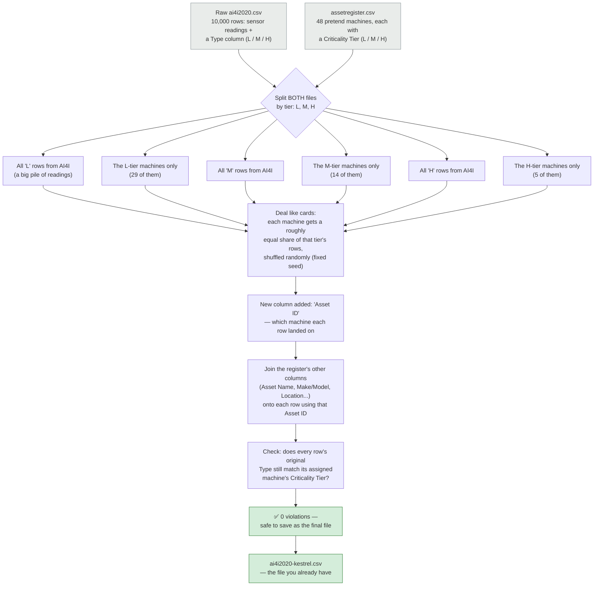
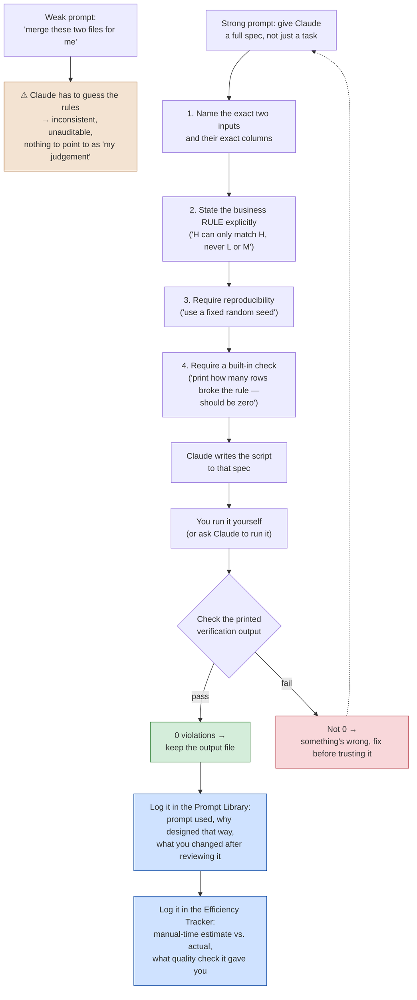

# How the AI4I ↔ Asset Register Merge Actually Works

**Short answer up front:** you don't need to merge these two files — `ai4i2020kestrel.csv` already *is* the merged result. `reskin_deal.py` did it already, in a previous session. What's below explains exactly how, and then how to get Claude to do this kind of task well if you ever need to do something similar again.

---

## Flowchart 1 — What `reskin_deal.py` actually did

**Plain-language walkthrough:** imagine you have 10,000 playing cards (the AI4I rows) and 48 buckets (your machines). You're not allowed to drop a card in just any bucket — a card marked "H" can only go in one of the 5 "H" buckets, never an "L" or "M" one. So the script splits both the cards and the buckets into three separate piles by tier first. Within each pile, it shuffles the matching cards and deals them out as evenly as possible across that pile's buckets — same idea as dealing a deck of cards around a table. Once every card has a bucket (an Asset ID), it goes back and stamps that machine's other details (name, make/model, site) onto the card. Then, before saving anything, it counts how many cards ended up in the wrong-tier bucket — the answer has to be zero, or something's broken. That zero-violations check is what makes this "auditable" instead of "trust me."

---

## Flowchart 2 — Is this a good way to show your AI skills, and how do you direct Claude to do it?

**Short answer: yes, this is one of the best examples in your whole project** — but only because of *how* it was asked for, not just that AI wrote some code. The difference is in the flowchart below.

**Why this is genuinely a strong example, in plain terms:** anyone can type "merge these two files." What makes `reskin_deal.py` a good portfolio artifact is that the actual request behind it had four specific ingredients — a stated business rule (tier-matching), a demand for reproducibility (the fixed seed), and a demand for proof it worked (the violation count printed at the end). That's the difference between "I asked AI to do my homework" and "I specified an engineering problem and verified the AI's solution" — which is exactly the story this whole portfolio project is trying to tell.

**How to actually get Claude to do this, step by step, next time you need something similar:**

1. Tell Claude exactly what the two inputs are and paste (or describe) their real column names — don't say "my data," say "AI4I has columns X, Y, Z."
2. State the rule as a sentence a non-technical person could check by eye — "a High row can only go to a High asset" is testable; "match them sensibly" is not.
3. Ask for reproducibility explicitly — "use a fixed random seed so this can be re-run and get the same result." This is what makes the whole thing auditable rather than a one-off fluke.
4. Ask Claude to build in its own proof — "print a count of any rows that broke the rule, so I can confirm it's zero before trusting the output." This is the same "verification step" technique the Master Plan calls for on Day 9's cleaning work.
5. Once it runs cleanly, that's your Prompt Library entry: the prompt, why you asked for it that way, and — critically — anything you personally changed or caught afterward (like the stale comment-count fix from earlier, which is a small but real example of you catching something Claude didn't).

So to directly answer your question: yes, keep this one — it's a strong prompt-library entry exactly as it already exists. The next thing worth doing isn't re-merging anything, it's writing up *this exact exchange* (the four-ingredient spec, the verification check, your own catch of the comment bug) as a proper Prompt Library entry, since it's a clean, concrete example of directing AI with real engineering discipline rather than just asking it to "do the task."
