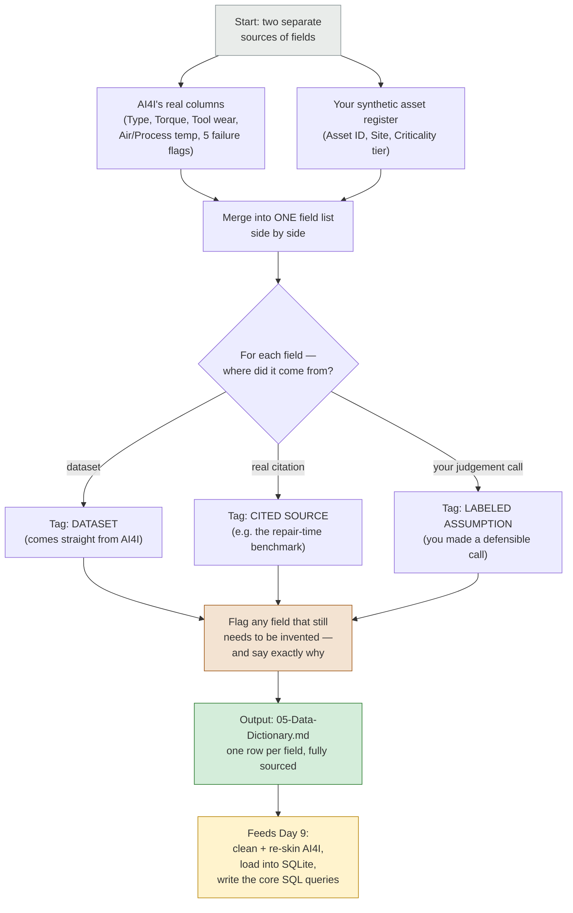

# Today's Task Flow — Week 2, Day 8: Data Dictionary

**In one sentence:** today we write down every field we're going to use — where it comes from, what it means — before touching any actual data. This is the "define your ingredients before you cook" step.

**Why this has to happen before Day 9:** Day 9 is where you actually clean and re-skin the AI4I dataset and load it into a database. You can't write a script to "clean the fields" until every field has a name, a meaning, and a source written down somewhere. This document is that somewhere.

---

## The flow for today

---

## What each box actually means, in plain terms

**Two separate sources of fields.** You're not building this from scratch — you're combining two things that already exist: AI4I's real sensor columns (the actual data file) and the asset register you invented in Week 1 (Asset ID, Site, Criticality tier). Neither one alone is enough; the dictionary is where they meet.

**Merge into one field list.** Literally one table, one row per field, whether it came from AI4I or from your own asset register. This is what makes the eventual cleaning script possible — the script just reads down this list and knows exactly what to do with each column.

**For each field — where did it come from?** This is the same three-way honesty rule you've used everywhere else in this project. A field is either straight from the dataset (e.g. Torque — it's just there in AI4I), backed by a real external citation (e.g. repair time, sourced from the mining-reliability papers), or a labeled assumption you made yourself (e.g. which specific machine an AI4I row got assigned to). Nothing gets to just sit there unlabeled.

**Flag anything that still needs inventing.** A few fields won't exist anywhere yet — for example, if the cause-code taxonomy redesign (FR-14) ever gets built, its new simplified code list would need to be invented here, with a note explaining why the old 40-option list wasn't kept. Better to name these gaps now than discover them mid-script on Day 9.

**Output: 05-Data-Dictionary.md.** The actual deliverable — one table, every field, every source tagged, nothing hidden.

**Feeds Day 9.** Once this exists, the Day 9 cleaning script has a spec to follow instead of guesswork — that's the entire point of doing this step first.

---

*Ready when you are — say the word and I'll start building the actual field list.*
