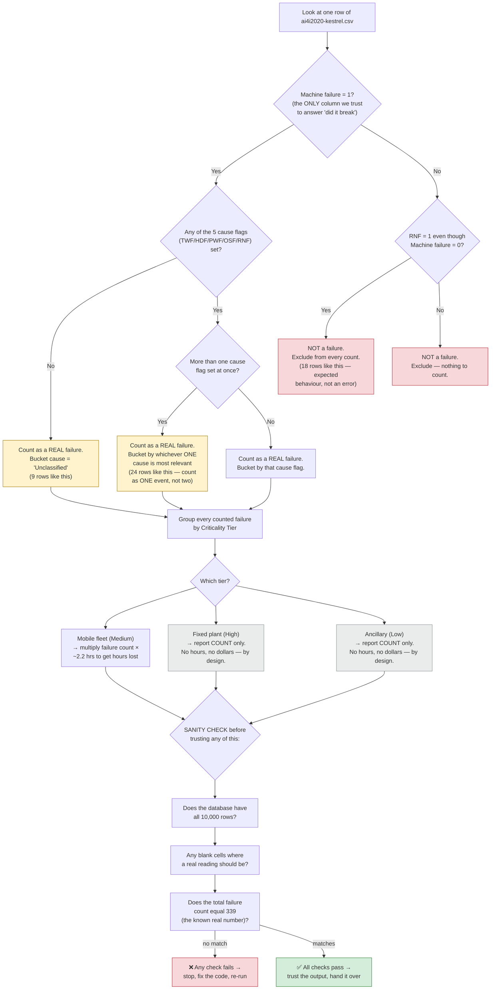
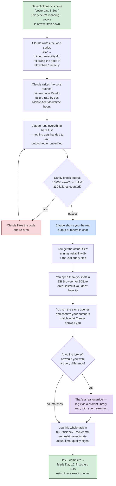

# Day 9 — Loading the Data & Writing the Core Queries, in Flowcharts

Two flowcharts here: first, exactly what rules the SQL query code has to follow (the "spec" from the last message, drawn out instead of written as one dense paragraph). Second, the actual step-by-step plan for today — who does what, in what order.

---

## Flowchart 1 — The rules the query code must follow (the "spec")

**Plain-language walkthrough:** every one of the 10,000 rows goes through this same decision tree. First question, always: does `Machine failure` say 1? That column is the referee — nothing else gets a vote on whether a breakdown "really" happened. If yes, we still count it even when none of the five cause flags are set (9 rows), we still count it as just one event even when two flags fired together (24 rows), and we bucket it by cause. If `Machine failure` says 0, the row is not a breakdown, full stop — even the 18 rows where `RNF` is oddly set to 1 anyway. Once every row has been sorted into "real failure" or "not," the failures get grouped by which tier the asset belongs to, and only the Mobile fleet gets turned into an hours-lost number, because that's the only tier with a real, trustworthy repair-time figure behind it. Last step, before any of these numbers get used anywhere: three checks against facts we already know are true (10,000 rows, no missing data, exactly 339 real failures). If even one of those doesn't match, something in the code above broke a rule and needs fixing before the numbers can be trusted.

---

## Flowchart 2 — Today's actual plan (who does what, in order)

**Plain-language walkthrough:** you're not starting from a blank page today — yesterday's Data Dictionary is the actual spec this code gets built against, so nothing here is guesswork. Claude writes the load script and the three core queries, runs them in this sandbox first, and checks the sanity numbers before showing you anything — if the check fails, Claude fixes it silently and re-runs rather than handing you broken output to debug. Once it passes, you get the real files (not screenshots or pasted text) — the actual database and the actual `.sql` files — and you open and run them yourself in a free tool called DB Browser for SQLite. That's the step that makes this yours: if your numbers match, great, that's confirmation; if something looks off or you'd have written a query differently, that's exactly the kind of "I caught something and changed it" moment worth logging in the prompt library. Either way, this task gets one line in the Efficiency Tracker before we move to Day 10, which is the first day real business-question answers come out of this pipeline instead of a plan for getting there.

---

**Next message will be the actual load script and queries**, built to the Flowchart 1 spec, run here, with the sanity-check output shown to you directly.
